# InfiTimePro – Enterprise Time & Attendance SaaS Platform
## 00. Product Constitution & Core Architecture Principles

```
  ████████╗██╗███╗   ███╗███████╗██████╗ ██████╗  ██████╗ 
  ╚══██╔══╝██║████╗ ████║██╔════╝██╔══██╗██╔══██╗██╔═══██╗
     ██║   ██║██╔████╔██║█████╗  ██████╔╝██████╔╝██║   ██║
     ██║   ██║██║╚██╔╝██║██╔══╝  ██╔═══╝ ██╔══██╗██║   ██║
     ██║   ██║██║ ╚═╝ ██║███████╗██║     ██║  ██║╚██████╔╝
     ╚═╝   ╚═╝╚═╝     ╚═╝╚══════╝╚═╝     ╚═╝  ╚═╝ ╚═════╝ 
            People. Time. A Smarter Tomorrow.
```

---

### 1. Executive Summary & Mission
**InfiTimePro** is an enterprise-grade, multi-tenant Time & Attendance Software-as-a-Service (SaaS) platform architected to serve organizations ranging from agile 10-person teams to global multinational enterprises with 100,000+ workers distributed across legal entities, business units, branches, manufacturing plants, field locations, and complex multi-region timezones.

InfiTimePro operates on one fundamental tenet:
> **"Capture Immutable Facts $\to$ Apply Transparent, Versioned Policies $\to$ Generate Explainable Attendance $\to$ Resolve Exceptions $\to$ Streamline Approvals $\to$ Finalise for Flawless Payroll."**

---

### 2. The 20 Non-Negotiable Engineering Principles

1. **Visual Fidelity as Truth**: The uploaded 52 UI reference screens represent the exact functional and visual design benchmark. No views, tabs, actions, filters, KPIs, status pills, or drawer modals may be omitted or simplified without documented change orders.
2. **Custom Database & Pristine Schemas (`infi_timepro_db`)**: We construct a proprietary, completely custom, highly normalized database architecture (`infi_timepro_db`) partitioned into logical domain namespaces (e.g., `tp_tenants`, `tp_workforce`, `tp_time_events`, `tp_shifts`, `tp_policies`, `tp_approvals`). No legacy schemas or borrowed structures are used.
3. **Multi-Tenant Logical & Physical Isolation**: Every tenant-owned record strictly carries a `tenant_id`. Tenancy scoping is enforced at the backend gateway and repository layers. Client-supplied `tenant_id` or `employee_id` headers are never trusted.
4. **Immutability of Raw Punches**: Raw biometric, mobile, QR, web, and kiosk time events are immutable facts. A raw event is never edited or overwritten; corrections occur purely via audited regularisation transactions.
5. **Explainability of Attendance Decisions**: Every calculated attendance day must be fully explainable. The system must be able to prove mathematically why an employee was marked *Present*, *Late*, *Half-Day*, *Absent*, or earned *Overtime*, showing the exact policy version and thresholds applied.
6. **Effective Dating & Versioning**: All organizational assignments, shift assignments, holiday calendars, weekly-offs, and policy rule sets are effective-dated (`effective_from` $\to$ `effective_to`) and versioned. Changing a policy today never silently alters historical attendance.
7. **Strict UTC Storage & Contextual Timezone Handling**: All timestamps are persisted in UTC. Attendance calculations, punch normalization, and shifts are evaluated using the contextual IANA timezone of the assigned work location and shift.
8. **Currency & Precision Integrity**: All monetary hooks (overtime rates, allowances, billing) use ISO 4217 standard currency codes and fixed decimal arithmetic (`DECIMAL(14,4)` or integer minor units). Floating-point math is strictly forbidden for financial calculations.
9. **Zero Business Logic in Presentation Layers**: React Web and Flutter Mobile applications are purely presentation and interaction clients. All attendance calculations, policy rules, and state validations reside in the backend domain services.
10. **Unified API Contract**: Web and mobile platforms consume the exact same versioned REST API (`/api/v1/*`) and are bound by the same RBAC/ABAC authorization policies.
11. **Configurability Over Hard-Coding**: No company rules, grace windows, shift timings, overtime formulas, or approval flows are hard-coded into application code. Everything is tenant-configurable.
12. **Maker-Checker Governance**: Sensitive administrative operations (unlocking locked payroll periods, manual punch insertion, retroactive policy assignments) require dual authorization or comprehensive audit recording with mandatory reason codes.
13. **Resilient Offline-First Mobile Ingestion**: The Flutter mobile application records punches offline in encrypted local storage (`AES-256-GCM`), capturing device hardware timestamps and geofence telemetry, syncing asynchronously upon connectivity restoration.
14. **Hardware & Biometric Abstraction**: Biometric devices, face recognition terminals, and RFID readers communicate via modular device adapters (Push/ADMS, Pull API, SDK Bridge, Local Connector) implementing a standard `BiometricDeviceAdapter` interface.
15. **Event-Driven Integration Architecture**: Webhook emissions, third-party HRMS/Payroll synchronizations, and notifications are processed asynchronously via BullMQ/Redis queues with exponential backoff and dead-letter queues (DLQ).
16. **Privacy-by-Design & GDPR Adherence**: Biometric raw templates remain on physical hardware; the SaaS platform only stores cryptographic tokens or device punch logs. Employee location tracking is strictly geofence-event bound (no unconsented continuous GPS tracking).
17. **SOC 2 Type II & Audit Readiness**: Immutable audit trails record `who`, `when`, `tenant_id`, `ip_address`, `device_id`, `action`, `entity`, `previous_state`, `new_state`, and `correlation_id` across every CRUD operation.
18. **Idempotency & Concurrency Safety**: All write operations (punch ingestion, regularisation submission, approval transitions) utilize idempotency keys and optimistic locking (`version` column) to prevent race conditions.
19. **Internationalization & Localization (i18n / L10n)**: All UI strings, error messages, and notification templates are driven by translation keys with native support for RTL (Arabic, Hebrew) and multi-locale date/time formatting.
20. **Definition of Done (DoD)**: A feature is only declared complete when the database migrations, backend domain services, RBAC authorization, React Web UI, Flutter Mobile UI, automated test suite, audit logging, and OpenAPI documentation are verified.

---

### 3. High-Level Domain Breakdown

```mermaid
graph TD
    A[InfiTimePro Platform Core] --> B[Identity & Tenancy]
    A --> C[Workforce & Org Hierarchy]
    A --> D[Shift & Roster Management]
    A --> E[Time Event Ingestion Hub]
    A --> F[Attendance Calculation Engine]
    A --> G[Configurable Policy Engine]
    A --> H[Exceptions & Regularisation]
    A --> I[Approval Workflow Engine]
    A --> J[Overtime & Comp-Off Ledger]
    A --> K[Finalisation & Payroll Handoff]
    A --> L[Biometric & Geofencing Hub]
    A --> M[Enterprise Reporting & BI]
    A --> N[Audit, Security & Compliance]
```



---

### 4. Architectural Governance & Sign-Off
This constitution governs all codebases, schemas, APIs, and design tokens generated for InfiTimePro. Any deviation must be submitted to the Principal Product Architect via a formal Architectural Decision Record (ADR).
