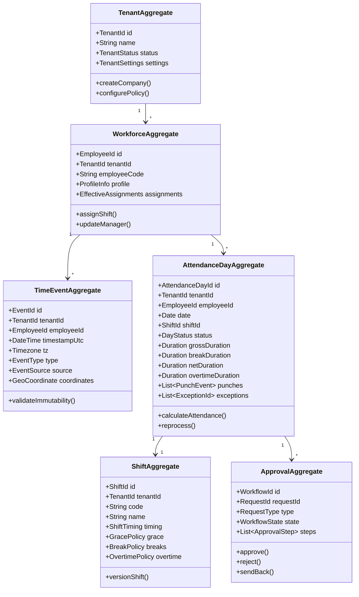
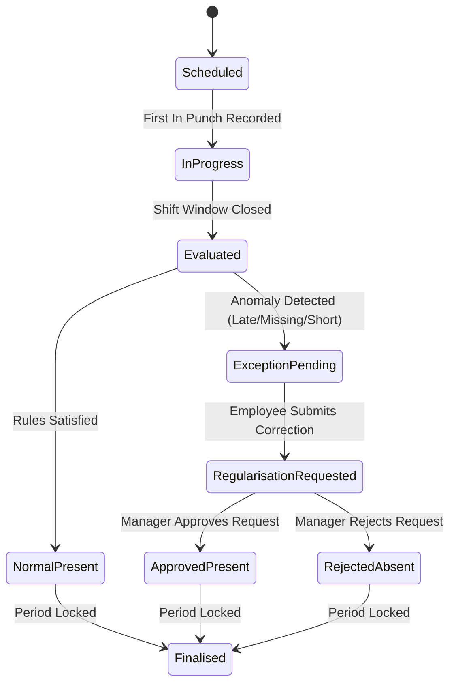
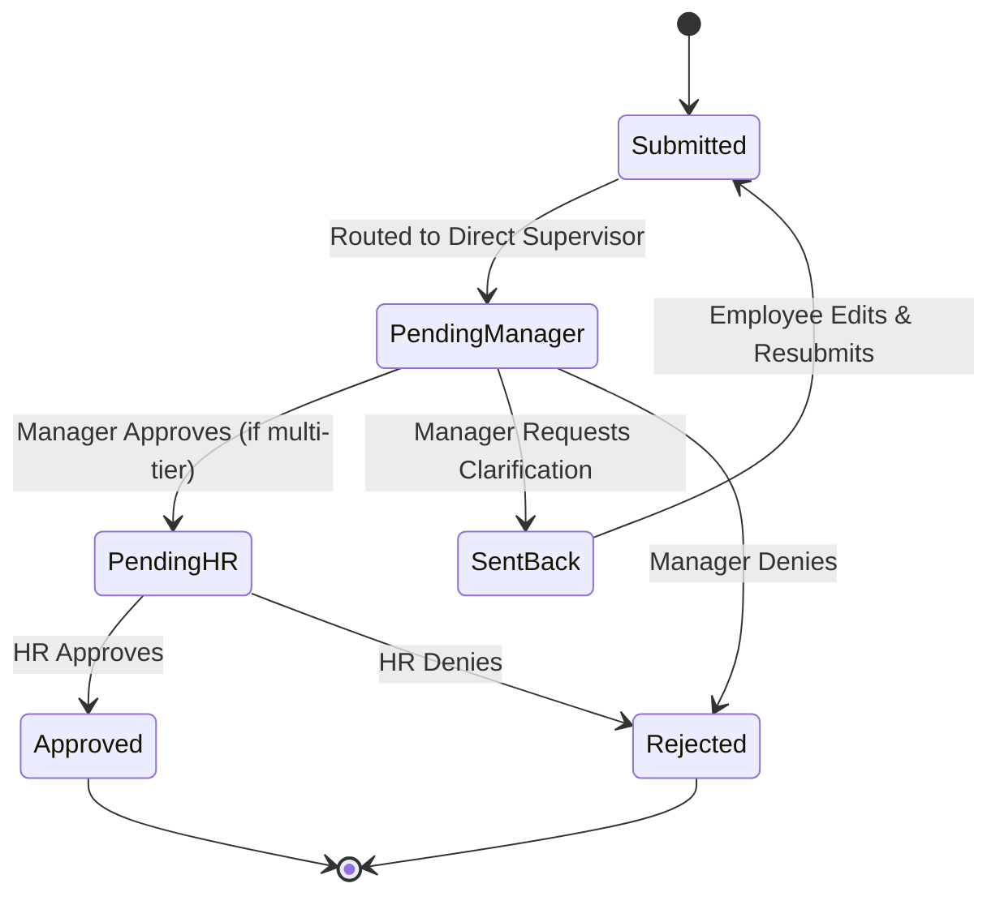

# InfiTimePro – Enterprise Time & Attendance SaaS Platform
## 04. Domain Model & Ubiquitous Language

This document specifies the Domain-Driven Design (DDD) architecture for InfiTimePro, detailing Aggregates, Entities, Value Objects, Domain Events, and State Machines.

---

### 1. Ubiquitous Language & Core Concepts

- **Tenant**: An isolated organizational subscription boundary in InfiTimePro.
- **Worker / Employee**: An individual subject to workforce scheduling and attendance tracking.
- **Raw Time Event (Punch)**: An immutable record of physical or digital clock-in/out telemetry.
- **Normalized Punch**: A sanitized, chronologically ordered, deduplicated time event mapped to a business punch classification.
- **Shift**: A scheduled operational time block defining start, end, grace windows, break durations, and overtime thresholds.
- **Roster / Schedule**: The planned assignment of shifts to workers over calendar dates.
- **Attendance Day**: The calculated daily record of presence, hours, break deductions, status, and compliance.
- **Attendance Exception**: An identified divergence between scheduled expectations and actual normalized events.
- **Regularisation**: An audited employee request and approval transaction that rectifies an attendance exception.
- **Approval Instance**: An active step-by-step workflow evaluating a pending workforce request.
- **Finalised Period**: An immutable, cryptographically sealed attendance period ready for payroll consumption.

---

### 2. Domain Aggregates & Entities

---

### 3. Value Objects

1. **`TenantId` / `EmployeeId` / `ShiftId`**: Strongly typed UUIDv7 identifiers.
2. **`GeoCoordinate`**: `{ latitude: number, longitude: number, accuracyMeters: number }`.
3. **`TimeWindow`**: `{ startUtc: DateTime, endUtc: DateTime, timezone: IANATimezone }`.
4. **`GracePolicy`**: `{ lateInMinutes: number, earlyOutMinutes: number, monthlyGraceLimit: number }`.
5. **`BreakPolicy`**: `{ totalDurationMinutes: number, isPaid: boolean, autoDeductThresholdMinutes: number }`.
6. **`WorkHoursSummary`**: `{ gross: Minutes, break: Minutes, net: Minutes, regular: Minutes, overtime: Minutes, shortfall: Minutes }`.

---

### 4. Domain Events

| Domain Event | Trigger Condition | Consuming Subsystems |
|---|---|---|
| `RawPunchReceivedEvent` | Device or mobile app transmits a clock event | Ingestion Hub, Idempotency Validator, Real-time Stream |
| `PunchNormalizedEvent` | Raw punch verified and deduplicated | Shift Matching Engine, Exception Detector |
| `AttendanceCalculatedEvent` | Daily calculation pipeline completes | Command Centre Analytics, Live Roster, Exception Hub |
| `AttendanceExceptionRaisedEvent` | Missing punch, late arrival, or shortfall detected | Notification Engine, Manager Alert Drawer |
| `RegularisationSubmittedEvent` | Employee submits correction with attachment | Approval Workflow Engine, Email/Push Dispatcher |
| `ApprovalStepCompletedEvent` | Manager or HR approves/rejects/sends back request | State Machine, Attendance Reprocessing Engine |
| `PeriodFinalisedEvent` | Admin locks pay period | Cryptographic Ledger, Payroll Handoff Exporter |

---

### 5. Core State Machines

#### A. Attendance Day Status State Machine

#### B. Approval Workflow State Machine

