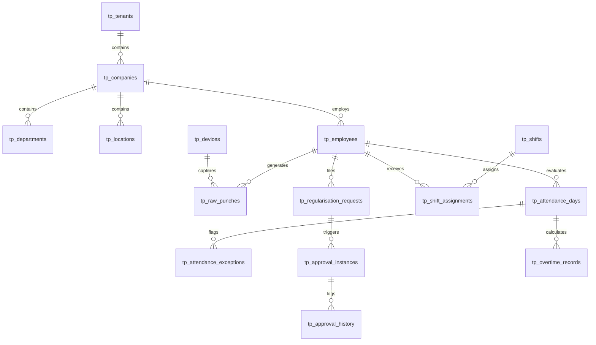

# InfiTimePro – Enterprise Time & Attendance SaaS Platform
## 05. Entity Relationship Diagram (ERD) & Database Schema (`infi_timepro_db`)

This document defines the physical relational schema for `infi_timepro_db` on MySQL 8+. All tables enforce mandatory multi-tenant logical partitioning (`tenant_id`), UUID primary keys, UTF8MB4 collation, foreign key constraints, and audit metadata (`created_at`, `updated_at`, `created_by`, `updated_by`, `deleted_at`).

---

### 1. High-Level Schema Architecture



---

### 2. Physical Table Definitions (`infi_timepro_db`)

#### Module 1: Tenancy & Identity
```sql
-- 1. Tenants Table
CREATE TABLE tp_tenants (
    id VARCHAR(36) PRIMARY KEY,
    code VARCHAR(50) NOT NULL UNIQUE,
    name VARCHAR(255) NOT NULL,
    subdomain VARCHAR(100) NOT NULL UNIQUE,
    custom_domain VARCHAR(255) NULL UNIQUE,
    status ENUM('trial', 'active', 'suspended', 'archived') NOT NULL DEFAULT 'trial',
    default_timezone VARCHAR(64) NOT NULL DEFAULT 'UTC',
    default_currency CHAR(3) NOT NULL DEFAULT 'USD',
    default_language VARCHAR(10) NOT NULL DEFAULT 'en-US',
    date_format VARCHAR(20) NOT NULL DEFAULT 'YYYY-MM-DD',
    time_format ENUM('12h', '24h') NOT NULL DEFAULT '12h',
    branding_config JSON NULL,
    created_at TIMESTAMP NOT NULL DEFAULT CURRENT_TIMESTAMP,
    updated_at TIMESTAMP NOT NULL DEFAULT CURRENT_TIMESTAMP ON UPDATE CURRENT_TIMESTAMP,
    deleted_at TIMESTAMP NULL,
    INDEX idx_tenant_status (status)
) ENGINE=InnoDB DEFAULT CHARSET=utf8mb4 COLLATE=utf8mb4_unicode_ci;

-- 2. Users Table
CREATE TABLE tp_users (
    id VARCHAR(36) PRIMARY KEY,
    tenant_id VARCHAR(36) NOT NULL,
    email VARCHAR(255) NOT NULL,
    username VARCHAR(100) NULL,
    password_hash VARCHAR(255) NOT NULL,
    first_name VARCHAR(100) NOT NULL,
    last_name VARCHAR(100) NOT NULL,
    avatar_url VARCHAR(500) NULL,
    phone_number VARCHAR(30) NULL,
    is_active BOOLEAN NOT NULL DEFAULT TRUE,
    is_mfa_enabled BOOLEAN NOT NULL DEFAULT FALSE,
    mfa_secret VARCHAR(255) NULL,
    last_login_at TIMESTAMP NULL,
    created_at TIMESTAMP NOT NULL DEFAULT CURRENT_TIMESTAMP,
    updated_at TIMESTAMP NOT NULL DEFAULT CURRENT_TIMESTAMP ON UPDATE CURRENT_TIMESTAMP,
    deleted_at TIMESTAMP NULL,
    CONSTRAINT fk_users_tenant FOREIGN KEY (tenant_id) REFERENCES tp_tenants(id) ON DELETE CASCADE,
    UNIQUE KEY uk_tenant_email (tenant_id, email, deleted_at),
    INDEX idx_user_tenant_active (tenant_id, is_active)
) ENGINE=InnoDB DEFAULT CHARSET=utf8mb4 COLLATE=utf8mb4_unicode_ci;

-- 3. Roles & Permissions Tables
CREATE TABLE tp_roles (
    id VARCHAR(36) PRIMARY KEY,
    tenant_id VARCHAR(36) NOT NULL,
    code VARCHAR(50) NOT NULL,
    name VARCHAR(100) NOT NULL,
    description VARCHAR(255) NULL,
    is_system BOOLEAN NOT NULL DEFAULT FALSE,
    created_at TIMESTAMP NOT NULL DEFAULT CURRENT_TIMESTAMP,
    updated_at TIMESTAMP NOT NULL DEFAULT CURRENT_TIMESTAMP ON UPDATE CURRENT_TIMESTAMP,
    CONSTRAINT fk_roles_tenant FOREIGN KEY (tenant_id) REFERENCES tp_tenants(id) ON DELETE CASCADE,
    UNIQUE KEY uk_tenant_role_code (tenant_id, code)
) ENGINE=InnoDB DEFAULT CHARSET=utf8mb4 COLLATE=utf8mb4_unicode_ci;

CREATE TABLE tp_permissions (
    id VARCHAR(36) PRIMARY KEY,
    code VARCHAR(100) NOT NULL UNIQUE,
    module VARCHAR(50) NOT NULL,
    action VARCHAR(50) NOT NULL,
    description VARCHAR(255) NOT NULL
) ENGINE=InnoDB DEFAULT CHARSET=utf8mb4 COLLATE=utf8mb4_unicode_ci;

CREATE TABLE tp_role_permissions (
    role_id VARCHAR(36) NOT NULL,
    permission_id VARCHAR(36) NOT NULL,
    PRIMARY KEY (role_id, permission_id),
    CONSTRAINT fk_rp_role FOREIGN KEY (role_id) REFERENCES tp_roles(id) ON DELETE CASCADE,
    CONSTRAINT fk_rp_permission FOREIGN KEY (permission_id) REFERENCES tp_permissions(id) ON DELETE CASCADE
) ENGINE=InnoDB DEFAULT CHARSET=utf8mb4 COLLATE=utf8mb4_unicode_ci;
```

#### Module 2: Organization & Workforce
```sql
-- 4. Locations & Geofences
CREATE TABLE tp_locations (
    id VARCHAR(36) PRIMARY KEY,
    tenant_id VARCHAR(36) NOT NULL,
    code VARCHAR(50) NOT NULL,
    name VARCHAR(150) NOT NULL,
    address_line1 VARCHAR(255) NOT NULL,
    address_line2 VARCHAR(255) NULL,
    city VARCHAR(100) NOT NULL,
    state VARCHAR(100) NOT NULL,
    country VARCHAR(100) NOT NULL,
    postal_code VARCHAR(20) NOT NULL,
    timezone VARCHAR(64) NOT NULL DEFAULT 'UTC',
    latitude DECIMAL(10, 8) NOT NULL,
    longitude DECIMAL(11, 8) NOT NULL,
    geofence_radius_meters INT NOT NULL DEFAULT 100,
    geofence_polygon JSON NULL,
    is_active BOOLEAN NOT NULL DEFAULT TRUE,
    created_at TIMESTAMP NOT NULL DEFAULT CURRENT_TIMESTAMP,
    updated_at TIMESTAMP NOT NULL DEFAULT CURRENT_TIMESTAMP ON UPDATE CURRENT_TIMESTAMP,
    CONSTRAINT fk_loc_tenant FOREIGN KEY (tenant_id) REFERENCES tp_tenants(id) ON DELETE CASCADE,
    UNIQUE KEY uk_tenant_location_code (tenant_id, code)
) ENGINE=InnoDB DEFAULT CHARSET=utf8mb4 COLLATE=utf8mb4_unicode_ci;

-- 5. Departments
CREATE TABLE tp_departments (
    id VARCHAR(36) PRIMARY KEY,
    tenant_id VARCHAR(36) NOT NULL,
    code VARCHAR(50) NOT NULL,
    name VARCHAR(150) NOT NULL,
    head_employee_id VARCHAR(36) NULL,
    is_active BOOLEAN NOT NULL DEFAULT TRUE,
    created_at TIMESTAMP NOT NULL DEFAULT CURRENT_TIMESTAMP,
    updated_at TIMESTAMP NOT NULL DEFAULT CURRENT_TIMESTAMP ON UPDATE CURRENT_TIMESTAMP,
    CONSTRAINT fk_dept_tenant FOREIGN KEY (tenant_id) REFERENCES tp_tenants(id) ON DELETE CASCADE,
    UNIQUE KEY uk_tenant_dept_code (tenant_id, code)
) ENGINE=InnoDB DEFAULT CHARSET=utf8mb4 COLLATE=utf8mb4_unicode_ci;

-- 6. Employees Table
CREATE TABLE tp_employees (
    id VARCHAR(36) PRIMARY KEY,
    tenant_id VARCHAR(36) NOT NULL,
    user_id VARCHAR(36) NULL UNIQUE,
    employee_code VARCHAR(50) NOT NULL,
    biometric_id VARCHAR(50) NULL,
    first_name VARCHAR(100) NOT NULL,
    last_name VARCHAR(100) NOT NULL,
    avatar_url VARCHAR(500) NULL,
    job_title VARCHAR(100) NOT NULL,
    department_id VARCHAR(36) NOT NULL,
    location_id VARCHAR(36) NOT NULL,
    reporting_manager_id VARCHAR(36) NULL,
    employment_type ENUM('full_time', 'part_time', 'contractor', 'consultant', 'intern', 'daily_wage') NOT NULL DEFAULT 'full_time',
    employment_status ENUM('active', 'probation', 'notice_period', 'terminated', 'resigned') NOT NULL DEFAULT 'active',
    joining_date DATE NOT NULL,
    exit_date DATE NULL,
    overtime_eligible BOOLEAN NOT NULL DEFAULT TRUE,
    remote_work_eligible BOOLEAN NOT NULL DEFAULT FALSE,
    created_at TIMESTAMP NOT NULL DEFAULT CURRENT_TIMESTAMP,
    updated_at TIMESTAMP NOT NULL DEFAULT CURRENT_TIMESTAMP ON UPDATE CURRENT_TIMESTAMP,
    deleted_at TIMESTAMP NULL,
    CONSTRAINT fk_emp_tenant FOREIGN KEY (tenant_id) REFERENCES tp_tenants(id) ON DELETE CASCADE,
    CONSTRAINT fk_emp_user FOREIGN KEY (user_id) REFERENCES tp_users(id) ON DELETE SET NULL,
    CONSTRAINT fk_emp_dept FOREIGN KEY (department_id) REFERENCES tp_departments(id),
    CONSTRAINT fk_emp_loc FOREIGN KEY (location_id) REFERENCES tp_locations(id),
    CONSTRAINT fk_emp_manager FOREIGN KEY (reporting_manager_id) REFERENCES tp_employees(id) ON DELETE SET NULL,
    UNIQUE KEY uk_tenant_emp_code (tenant_id, employee_code, deleted_at),
    INDEX idx_emp_tenant_dept (tenant_id, department_id),
    INDEX idx_emp_tenant_loc (tenant_id, location_id)
) ENGINE=InnoDB DEFAULT CHARSET=utf8mb4 COLLATE=utf8mb4_unicode_ci;
```

#### Module 3: Shifts & Rostering
```sql
-- 7. Shifts Library
CREATE TABLE tp_shifts (
    id VARCHAR(36) PRIMARY KEY,
    tenant_id VARCHAR(36) NOT NULL,
    code VARCHAR(30) NOT NULL,
    name VARCHAR(100) NOT NULL,
    description TEXT NULL,
    shift_type ENUM('fixed', 'flexible', 'rotational', 'night', 'cross_midnight', 'split') NOT NULL DEFAULT 'fixed',
    shift_category ENUM('general', 'production', 'support', 'management', 'field') NOT NULL DEFAULT 'general',
    color_hex VARCHAR(10) NOT NULL DEFAULT '#3B82F6',
    start_time TIME NOT NULL,
    end_time TIME NOT NULL,
    duration_minutes INT NOT NULL DEFAULT 480,
    break_duration_minutes INT NOT NULL DEFAULT 60,
    is_break_paid BOOLEAN NOT NULL DEFAULT FALSE,
    grace_in_minutes INT NOT NULL DEFAULT 15,
    grace_out_minutes INT NOT NULL DEFAULT 15,
    half_day_threshold_minutes INT NOT NULL DEFAULT 240,
    full_day_threshold_minutes INT NOT NULL DEFAULT 480,
    overtime_threshold_minutes INT NOT NULL DEFAULT 480,
    auto_detect_enabled BOOLEAN NOT NULL DEFAULT FALSE,
    status ENUM('active', 'draft', 'archived') NOT NULL DEFAULT 'active',
    created_at TIMESTAMP NOT NULL DEFAULT CURRENT_TIMESTAMP,
    updated_at TIMESTAMP NOT NULL DEFAULT CURRENT_TIMESTAMP ON UPDATE CURRENT_TIMESTAMP,
    CONSTRAINT fk_shift_tenant FOREIGN KEY (tenant_id) REFERENCES tp_tenants(id) ON DELETE CASCADE,
    UNIQUE KEY uk_tenant_shift_code (tenant_id, code)
) ENGINE=InnoDB DEFAULT CHARSET=utf8mb4 COLLATE=utf8mb4_unicode_ci;

-- 8. Shift Groups
CREATE TABLE tp_shift_groups (
    id VARCHAR(36) PRIMARY KEY,
    tenant_id VARCHAR(36) NOT NULL,
    code VARCHAR(50) NOT NULL,
    name VARCHAR(100) NOT NULL,
    description TEXT NULL,
    pattern_type ENUM('fixed', 'rotational', 'flexible') NOT NULL DEFAULT 'fixed',
    rotation_cycle_days INT NOT NULL DEFAULT 7,
    status ENUM('active', 'inactive', 'archived') NOT NULL DEFAULT 'active',
    created_at TIMESTAMP NOT NULL DEFAULT CURRENT_TIMESTAMP,
    updated_at TIMESTAMP NOT NULL DEFAULT CURRENT_TIMESTAMP ON UPDATE CURRENT_TIMESTAMP,
    CONSTRAINT fk_shift_grp_tenant FOREIGN KEY (tenant_id) REFERENCES tp_tenants(id) ON DELETE CASCADE,
    UNIQUE KEY uk_tenant_grp_code (tenant_id, code)
) ENGINE=InnoDB DEFAULT CHARSET=utf8mb4 COLLATE=utf8mb4_unicode_ci;

-- 9. Shift Assignments (Effective-Dated)
CREATE TABLE tp_shift_assignments (
    id VARCHAR(36) PRIMARY KEY,
    tenant_id VARCHAR(36) NOT NULL,
    employee_id VARCHAR(36) NOT NULL,
    shift_id VARCHAR(36) NOT NULL,
    effective_from DATE NOT NULL,
    effective_to DATE NOT NULL,
    assigned_by VARCHAR(36) NOT NULL,
    status ENUM('active', 'scheduled', 'expired', 'cancelled') NOT NULL DEFAULT 'active',
    remarks TEXT NULL,
    created_at TIMESTAMP NOT NULL DEFAULT CURRENT_TIMESTAMP,
    updated_at TIMESTAMP NOT NULL DEFAULT CURRENT_TIMESTAMP ON UPDATE CURRENT_TIMESTAMP,
    CONSTRAINT fk_sa_tenant FOREIGN KEY (tenant_id) REFERENCES tp_tenants(id) ON DELETE CASCADE,
    CONSTRAINT fk_sa_employee FOREIGN KEY (employee_id) REFERENCES tp_employees(id) ON DELETE CASCADE,
    CONSTRAINT fk_sa_shift FOREIGN KEY (shift_id) REFERENCES tp_shifts(id),
    INDEX idx_sa_lookup (tenant_id, employee_id, effective_from, effective_to)
) ENGINE=InnoDB DEFAULT CHARSET=utf8mb4 COLLATE=utf8mb4_unicode_ci;
```

#### Module 4: Time Events & Attendance Engine
```sql
-- 10. Devices Master
CREATE TABLE tp_devices (
    id VARCHAR(36) PRIMARY KEY,
    tenant_id VARCHAR(36) NOT NULL,
    device_identifier VARCHAR(100) NOT NULL,
    name VARCHAR(100) NOT NULL,
    device_type ENUM('biometric_terminal', 'face_recognition', 'rfid_reader', 'mobile_app', 'web_kiosk') NOT NULL,
    location_id VARCHAR(36) NOT NULL,
    ip_address VARCHAR(45) NULL,
    status ENUM('online', 'offline', 'error', 'maintenance') NOT NULL DEFAULT 'online',
    last_heartbeat_at TIMESTAMP NULL,
    created_at TIMESTAMP NOT NULL DEFAULT CURRENT_TIMESTAMP,
    updated_at TIMESTAMP NOT NULL DEFAULT CURRENT_TIMESTAMP ON UPDATE CURRENT_TIMESTAMP,
    CONSTRAINT fk_dev_tenant FOREIGN KEY (tenant_id) REFERENCES tp_tenants(id) ON DELETE CASCADE,
    CONSTRAINT fk_dev_location FOREIGN KEY (location_id) REFERENCES tp_locations(id),
    UNIQUE KEY uk_tenant_dev_id (tenant_id, device_identifier)
) ENGINE=InnoDB DEFAULT CHARSET=utf8mb4 COLLATE=utf8mb4_unicode_ci;

-- 11. Raw Punches (Immutable Telemetry Facts)
CREATE TABLE tp_raw_punches (
    id VARCHAR(36) PRIMARY KEY,
    tenant_id VARCHAR(36) NOT NULL,
    employee_id VARCHAR(36) NOT NULL,
    punch_timestamp_utc TIMESTAMP NOT NULL,
    device_timezone VARCHAR(64) NOT NULL DEFAULT 'UTC',
    event_type ENUM('IN', 'OUT', 'BREAK_OUT', 'BREAK_IN', 'MANUAL') NOT NULL,
    source ENUM('biometric', 'face_recognition', 'rfid', 'mobile_app', 'web_portal', 'geofence', 'admin_manual') NOT NULL,
    device_id VARCHAR(36) NULL,
    location_id VARCHAR(36) NULL,
    latitude DECIMAL(10, 8) NULL,
    longitude DECIMAL(11, 8) NULL,
    is_flagged BOOLEAN NOT NULL DEFAULT FALSE,
    flag_reason VARCHAR(255) NULL,
    idempotency_hash VARCHAR(64) NOT NULL,
    created_at TIMESTAMP NOT NULL DEFAULT CURRENT_TIMESTAMP,
    CONSTRAINT fk_punch_tenant FOREIGN KEY (tenant_id) REFERENCES tp_tenants(id) ON DELETE CASCADE,
    CONSTRAINT fk_punch_emp FOREIGN KEY (employee_id) REFERENCES tp_employees(id) ON DELETE CASCADE,
    CONSTRAINT fk_punch_device FOREIGN KEY (device_id) REFERENCES tp_devices(id) ON DELETE SET NULL,
    CONSTRAINT fk_punch_loc FOREIGN KEY (location_id) REFERENCES tp_locations(id) ON DELETE SET NULL,
    UNIQUE KEY uk_punch_idempotency (tenant_id, idempotency_hash),
    INDEX idx_raw_punch_stream (tenant_id, employee_id, punch_timestamp_utc)
) ENGINE=InnoDB DEFAULT CHARSET=utf8mb4 COLLATE=utf8mb4_unicode_ci;

-- 12. Processed Attendance Days
CREATE TABLE tp_attendance_days (
    id VARCHAR(36) PRIMARY KEY,
    tenant_id VARCHAR(36) NOT NULL,
    employee_id VARCHAR(36) NOT NULL,
    attendance_date DATE NOT NULL,
    shift_id VARCHAR(36) NOT NULL,
    location_id VARCHAR(36) NOT NULL,
    day_status ENUM('present', 'absent', 'half_day', 'late', 'early_departure', 'on_leave', 'wfh', 'field_duty', 'weekly_off', 'holiday', 'missing_punch', 'unscheduled') NOT NULL,
    first_in_time TIME NULL,
    last_out_time TIME NULL,
    gross_duration_minutes INT NOT NULL DEFAULT 0,
    break_duration_minutes INT NOT NULL DEFAULT 0,
    net_work_duration_minutes INT NOT NULL DEFAULT 0,
    regular_hours_minutes INT NOT NULL DEFAULT 0,
    overtime_duration_minutes INT NOT NULL DEFAULT 0,
    shortfall_duration_minutes INT NOT NULL DEFAULT 0,
    is_late BOOLEAN NOT NULL DEFAULT FALSE,
    late_by_minutes INT NOT NULL DEFAULT 0,
    is_early_out BOOLEAN NOT NULL DEFAULT FALSE,
    early_out_by_minutes INT NOT NULL DEFAULT 0,
    is_regularised BOOLEAN NOT NULL DEFAULT FALSE,
    is_finalised BOOLEAN NOT NULL DEFAULT FALSE,
    calculation_audit_log JSON NULL,
    created_at TIMESTAMP NOT NULL DEFAULT CURRENT_TIMESTAMP,
    updated_at TIMESTAMP NOT NULL DEFAULT CURRENT_TIMESTAMP ON UPDATE CURRENT_TIMESTAMP,
    CONSTRAINT fk_att_tenant FOREIGN KEY (tenant_id) REFERENCES tp_tenants(id) ON DELETE CASCADE,
    CONSTRAINT fk_att_emp FOREIGN KEY (employee_id) REFERENCES tp_employees(id) ON DELETE CASCADE,
    CONSTRAINT fk_att_shift FOREIGN KEY (shift_id) REFERENCES tp_shifts(id),
    CONSTRAINT fk_att_loc FOREIGN KEY (location_id) REFERENCES tp_locations(id),
    UNIQUE KEY uk_tenant_emp_date (tenant_id, employee_id, attendance_date),
    INDEX idx_att_date_status (tenant_id, attendance_date, day_status)
) ENGINE=InnoDB DEFAULT CHARSET=utf8mb4 COLLATE=utf8mb4_unicode_ci;

-- 13. Attendance Exceptions
CREATE TABLE tp_attendance_exceptions (
    id VARCHAR(36) PRIMARY KEY,
    tenant_id VARCHAR(36) NOT NULL,
    attendance_day_id VARCHAR(36) NOT NULL,
    employee_id VARCHAR(36) NOT NULL,
    exception_type ENUM('missing_in', 'missing_out', 'late_arrival', 'early_departure', 'short_hours', 'excessive_hours', 'geofence_breach', 'unscheduled') NOT NULL,
    severity ENUM('low', 'medium', 'high', 'critical') NOT NULL DEFAULT 'medium',
    status ENUM('open', 'in_progress', 'resolved', 'rejected', 'auto_cleared') NOT NULL DEFAULT 'open',
    details TEXT NOT NULL,
    resolution_notes TEXT NULL,
    resolved_by VARCHAR(36) NULL,
    resolved_at TIMESTAMP NULL,
    created_at TIMESTAMP NOT NULL DEFAULT CURRENT_TIMESTAMP,
    updated_at TIMESTAMP NOT NULL DEFAULT CURRENT_TIMESTAMP ON UPDATE CURRENT_TIMESTAMP,
    CONSTRAINT fk_exc_tenant FOREIGN KEY (tenant_id) REFERENCES tp_tenants(id) ON DELETE CASCADE,
    CONSTRAINT fk_exc_day FOREIGN KEY (attendance_day_id) REFERENCES tp_attendance_days(id) ON DELETE CASCADE,
    CONSTRAINT fk_exc_emp FOREIGN KEY (employee_id) REFERENCES tp_employees(id) ON DELETE CASCADE,
    INDEX idx_exc_tenant_status (tenant_id, status)
) ENGINE=InnoDB DEFAULT CHARSET=utf8mb4 COLLATE=utf8mb4_unicode_ci;
```

#### Module 5: Regularisation & Approvals
```sql
-- 14. Regularisation Requests
CREATE TABLE tp_regularisation_requests (
    id VARCHAR(36) PRIMARY KEY,
    tenant_id VARCHAR(36) NOT NULL,
    request_code VARCHAR(50) NOT NULL,
    employee_id VARCHAR(36) NOT NULL,
    attendance_date DATE NOT NULL,
    request_type ENUM('missing_punch', 'time_adjustment', 'full_day_present', 'half_day_present', 'wfh', 'field_duty') NOT NULL,
    reason TEXT NOT NULL,
    original_in_time TIME NULL,
    original_out_time TIME NULL,
    requested_in_time TIME NULL,
    requested_out_time TIME NULL,
    attachment_file_id VARCHAR(36) NULL,
    status ENUM('draft', 'pending', 'approved', 'rejected', 'sent_back', 'withdrawn') NOT NULL DEFAULT 'pending',
    created_at TIMESTAMP NOT NULL DEFAULT CURRENT_TIMESTAMP,
    updated_at TIMESTAMP NOT NULL DEFAULT CURRENT_TIMESTAMP ON UPDATE CURRENT_TIMESTAMP,
    CONSTRAINT fk_reg_tenant FOREIGN KEY (tenant_id) REFERENCES tp_tenants(id) ON DELETE CASCADE,
    CONSTRAINT fk_reg_emp FOREIGN KEY (employee_id) REFERENCES tp_employees(id) ON DELETE CASCADE,
    UNIQUE KEY uk_tenant_reg_code (tenant_id, request_code)
) ENGINE=InnoDB DEFAULT CHARSET=utf8mb4 COLLATE=utf8mb4_unicode_ci;

-- 15. Approval Workflows & Instances
CREATE TABLE tp_approval_instances (
    id VARCHAR(36) PRIMARY KEY,
    tenant_id VARCHAR(36) NOT NULL,
    entity_type ENUM('regularisation', 'overtime', 'shift_swap') NOT NULL,
    entity_id VARCHAR(36) NOT NULL,
    current_step INT NOT NULL DEFAULT 1,
    total_steps INT NOT NULL DEFAULT 2,
    current_assignee_id VARCHAR(36) NOT NULL,
    status ENUM('pending', 'approved', 'rejected', 'sent_back', 'cancelled') NOT NULL DEFAULT 'pending',
    created_at TIMESTAMP NOT NULL DEFAULT CURRENT_TIMESTAMP,
    updated_at TIMESTAMP NOT NULL DEFAULT CURRENT_TIMESTAMP ON UPDATE CURRENT_TIMESTAMP,
    CONSTRAINT fk_app_tenant FOREIGN KEY (tenant_id) REFERENCES tp_tenants(id) ON DELETE CASCADE,
    INDEX idx_app_assignee (tenant_id, current_assignee_id, status)
) ENGINE=InnoDB DEFAULT CHARSET=utf8mb4 COLLATE=utf8mb4_unicode_ci;

CREATE TABLE tp_approval_history (
    id VARCHAR(36) PRIMARY KEY,
    tenant_id VARCHAR(36) NOT NULL,
    approval_instance_id VARCHAR(36) NOT NULL,
    step_number INT NOT NULL,
    action ENUM('submitted', 'approved', 'rejected', 'sent_back', 'delegated') NOT NULL,
    actor_user_id VARCHAR(36) NOT NULL,
    actor_role VARCHAR(50) NOT NULL,
    comments TEXT NULL,
    action_timestamp TIMESTAMP NOT NULL DEFAULT CURRENT_TIMESTAMP,
    CONSTRAINT fk_ah_tenant FOREIGN KEY (tenant_id) REFERENCES tp_tenants(id) ON DELETE CASCADE,
    CONSTRAINT fk_ah_instance FOREIGN KEY (approval_instance_id) REFERENCES tp_approval_instances(id) ON DELETE CASCADE
) ENGINE=InnoDB DEFAULT CHARSET=utf8mb4 COLLATE=utf8mb4_unicode_ci;
```

#### Module 6: Audit Logs & Security
```sql
-- 16. Audit Logs Table (Forensic & SOC 2 Ready)
CREATE TABLE tp_audit_logs (
    id VARCHAR(36) PRIMARY KEY,
    tenant_id VARCHAR(36) NOT NULL,
    actor_user_id VARCHAR(36) NULL,
    actor_ip VARCHAR(45) NOT NULL,
    actor_device_id VARCHAR(100) NULL,
    correlation_id VARCHAR(64) NOT NULL,
    action VARCHAR(100) NOT NULL,
    entity_type VARCHAR(100) NOT NULL,
    entity_id VARCHAR(36) NOT NULL,
    previous_state JSON NULL,
    new_state JSON NULL,
    change_reason VARCHAR(255) NULL,
    created_at TIMESTAMP NOT NULL DEFAULT CURRENT_TIMESTAMP,
    INDEX idx_audit_tenant_time (tenant_id, created_at),
    INDEX idx_audit_entity (tenant_id, entity_type, entity_id)
) ENGINE=InnoDB DEFAULT CHARSET=utf8mb4 COLLATE=utf8mb4_unicode_ci;
```
