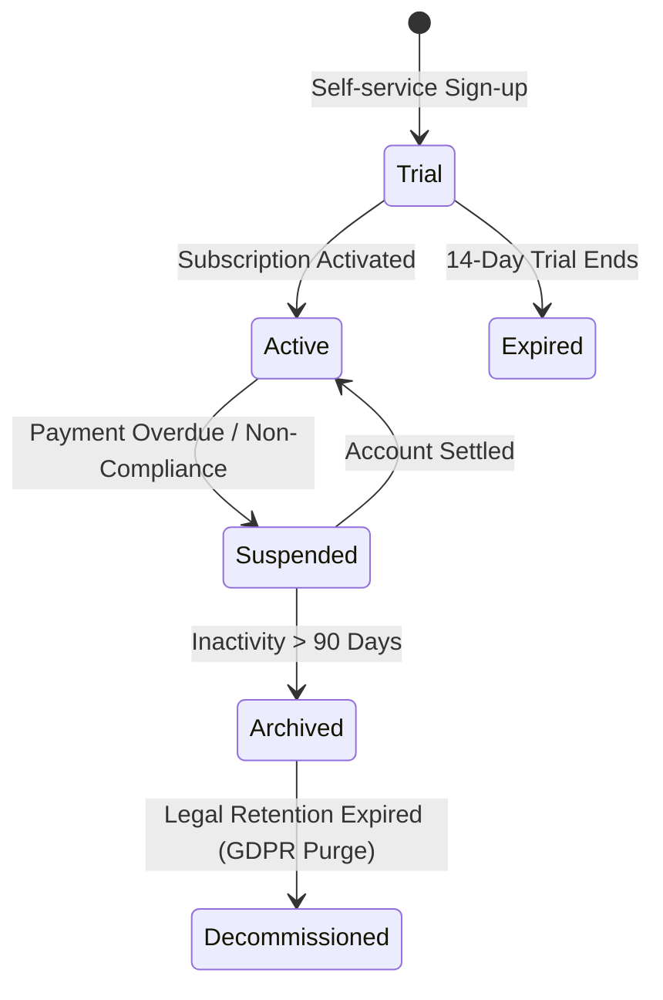

# InfiTimePro – Enterprise Time & Attendance SaaS Platform
## 06. Tenancy Architecture & Multi-Tenant Isolation

This document outlines the multi-tenant architecture of InfiTimePro, guaranteeing zero tenant data bleeding, dynamic tenant routing, cryptographic tenant context propagation, and enterprise tenant lifecycle isolation.

---

### 1. Multi-Tenant Architecture Overview

```mermaid
graph TD
    A[Client Request (Web / Mobile / Biometric Device)] --> B[API Gateway / Ingress]
    B --> C[Tenant Identification Middleware]
    C -->|Extract Host / JWT Subdomain| D{Resolve Tenant}
    D -->|Invalid / Suspended| E[HTTP 403 Forbidden / Tenant Inactive]
    D -->|Valid Tenant Context| F[TenantContextStore (AsyncLocalStorage)]
    F --> G[Service Layer]
    G --> H[Tenant Scoped Repositories]
    H -->|Auto-injected tenant_id| I[(infi_timepro_db Shared / Dedicated DB)]
    F --> J[Tenant-Partitioned Redis Cache: 'tenant:uuid:*']
    F --> K[Tenant-Partitioned BullMQ Queues: 'queue:tenant:uuid:*']
```

---

### 2. Tenancy Resolution Strategies

InfiTimePro supports three deterministic methods for tenant identification:
1. **Subdomain Identification**: `https://{tenant_slug}.infi_timepro.io/api/v1/*`
2. **Custom Domain Routing**: `https://attendance.acmecorp.com/api/v1/*` (Resolved via DNS CNAME and tenant domain registry)
3. **Cryptographic JWT Claims**: Authenticated requests carry `tenant_id` sealed within the signed RS256 JWT access token.

```typescript
// TenantContext Middleware Sample
import { AsyncLocalStorage } from 'async_hooks';

export interface TenantContext {
  tenantId: string;
  subdomain: string;
  timezone: string;
  currency: string;
  dateFormat: string;
  features: string[];
}

export const tenantStorage = new AsyncLocalStorage<TenantContext>();

export function getTenantContext(): TenantContext {
  const ctx = tenantStorage.getStore();
  if (!ctx) throw new Error('Tenant context missing from execution scope');
  return ctx;
}
```

---

### 3. Tenant Data Segregation & Protection

- **Repository Query Interceptor**: All database queries automatically append `WHERE tenant_id = :tenantId` at the ORM/Query Builder layer (Prisma client extensions or Kysely plugins).
- **Composite Unique Constraints**: Database tables enforce `(tenant_id, business_key)` to guarantee isolation across tenants.
- **Cache Isolation**: Redis key namespacing enforces `tp:{tenant_id}:{cache_key}`.
- **Storage Isolation**: Object storage S3/MinIO buckets use prefixed virtual directories: `s3://infi_timepro-tenant-storage/{tenant_id}/attachments/{file_id}`.

---

### 4. Tenant Lifecycle & State Transitions


