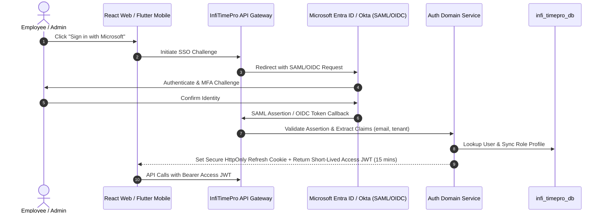

# InfiTimePro – Enterprise Time & Attendance SaaS Platform
## 07. Security Architecture & Threat Mitigation

This document defines the zero-trust security controls, cryptographic algorithms, identity protocols, session governance, and attack mitigations implemented across InfiTimePro.

---

### 1. Cryptographic Standards

| Security Domain | Algorithm / Standard | Implementation Detail |
|---|---|---|
| **Password Hashing** | Argon2id | `memoryCost: 65536`, `timeCost: 3`, `parallelism: 4` (RFC 9106) |
| **Token Signing** | RS256 (RSA 4096-bit) | Asymmetric key pairs with automated JWKS rotation every 90 days |
| **Data in Transit** | TLS 1.3 (Fallback TLS 1.2) | Strict HSTS with `max-age=63072000; includeSubDomains; preload` |
| **Data at Rest** | AES-256-GCM | Encrypted database tablespaces and column-level encryption for sensitive PII |
| **Webhook Signatures** | HMAC-SHA256 | Header `X-InfiTimePro-Signature: t=1726300000,v1=hex(hmac)` |
| **Mobile Storage** | AES-256-GCM | Flutter Secure Storage backed by Android KeyStore and iOS Keychain |

---

### 2. Identity, SSO & Token Architecture

---

### 3. Session Governance & Threat Mitigations

- **Access Token Lifetime**: 15 minutes, stateless RS256 JWT containing `sub`, `tenant_id`, `role`, and `scopes`.
- **Refresh Token Lifecycle**: 7 days, stored in `tp_user_sessions` with cryptographic rotation on every refresh request. Detection of refresh token reuse triggers immediate revocation of all user sessions.
- **CSRF Defense**: Double-submit cookie pattern with `SameSite=Strict` and `HttpOnly` flags on authentication cookies.
- **SQL Injection Prevention**: 100% parameterized queries via Prisma / Kysely ORM. Raw unsanitized SQL string concatenation is strictly banned.
- **XSS Mitigations**: Content Security Policy (CSP) headers, React JSX automatic HTML entity encoding, and DOMPurify sanitization on rendered remarks and reason notes.
- **Brute-Force & Rate Limiting**: Redis-backed token bucket algorithm (e.g. 5 failed login attempts per 15 minutes triggers account lockout and IP cooldown).
