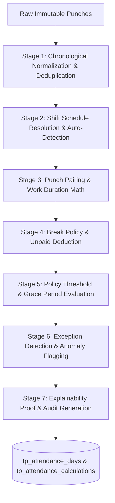

# InfiTimePro – Enterprise Time & Attendance SaaS Platform
## 11. Attendance Calculation Engine & Explanation Mathematical Specification

This document provides the mathematical algorithms, punch pairing rules, shift boundary resolution, and decision explainability engine that compute attendance in InfiTimePro.

---

### 1. The 7-Stage Attendance Calculation Pipeline



---

### 2. Mathematical Duration & Pairing Algorithms

Let $P = [p_1, p_2, \dots, p_n]$ be the chronologically ordered sequence of normalized punches for employee $E$ on attendance date $D$.

#### A. Punch Pairing Logic
1. **First-In / Last-Out Model**:
   $$\text{FirstIn} = \min(P), \quad \text{LastOut} = \max(P)$$
   $$\text{GrossDuration} = \text{LastOut} - \text{FirstIn}$$
2. **Interval / Multi-Punch Pairing Model**:
   When multiple IN/OUT cycles exist:
   $$\text{GrossDuration} = \sum_{k=1}^{m} (\text{OUT}_k - \text{IN}_k)$$

#### B. Break Duration Calculation
Let $B = [b_1, b_2, \dots, b_j]$ be recorded break punch pairs (BREAK_OUT to BREAK_IN).
$$\text{BreakDuration} = \sum_{k=1}^{j} (\text{BREAK\_IN}_k - \text{BREAK\_OUT}_k)$$

If policy dictates an automatic break deduction when actual recorded break is below threshold:
$$\text{AppliedBreak} = \max(\text{BreakDuration}, \text{ShiftPolicy.MandatoryMinBreak})$$

#### C. Net Work Duration & Overtime
$$\text{NetWorkDuration} = \max(0, \text{GrossDuration} - \text{AppliedBreak})$$

$$\text{OvertimeMinutes} = \begin{cases} 
\text{NetWorkDuration} - \text{Shift.ExpectedDuration}, & \text{if } \text{NetWorkDuration} > \text{Shift.OTThreshold} \land \text{Employee.OTEligible} \\
0, & \text{otherwise}
\end{cases}$$

$$\text{ShortfallMinutes} = \max(0, \text{Shift.ExpectedDuration} - \text{NetWorkDuration})$$

---

### 3. Grace & Lateness Evaluation Rules

Let $\text{ShiftStartTime}$ be $T_{start}$ and $\text{GraceIn}$ be $G_{in}$ (e.g. 15 minutes).

$$\text{LateMinutes} = \max(0, \text{FirstIn} - T_{start})$$

$$\text{IsLate} = \begin{cases} 
\text{TRUE}, & \text{if } \text{LateMinutes} > G_{in} \\
\text{FALSE}, & \text{if } \text{LateMinutes} \le G_{in}
\end{cases}$$

---

### 4. Day Status Determination Matrix

$$\text{DayStatus} = \begin{cases}
\text{Holiday}, & \text{if Date is in Assigned Holiday Calendar} \\
\text{WeeklyOff}, & \text{if Date matches Weekly Off Pattern} \land \text{Length}(P) = 0 \\
\text{OnLeave}, & \text{if Approved Leave Record Exists} \land \text{Length}(P) = 0 \\
\text{Absent}, & \text{if } \text{Length}(P) = 0 \land \text{Not Rest Day} \\
\text{MissingPunch}, & \text{if } \text{Length}(P) = 1 \lor \text{Unpaired In/Out} \\
\text{Present}, & \text{if } \text{NetWorkDuration} \ge \text{Shift.FullDayThreshold} \\
\text{HalfDay}, & \text{if } \text{Shift.HalfDayThreshold} \le \text{NetWorkDuration} < \text{Shift.FullDayThreshold} \\
\text{ShortHours}, & \text{if } \text{NetWorkDuration} < \text{Shift.HalfDayThreshold} \land \text{Length}(P) > 0
\end{cases}$$

---

### 5. Calculation Explainability Engine Output Sample

Every record in `tp_attendance_days` contains an explainability JSON proof:

```json
{
  "explanation": {
    "version": "1.0",
    "employee": { "code": "TP1012", "name": "Srinivas Reddy" },
    "date": "2025-04-28",
    "shift": {
      "code": "GS",
      "name": "General Shift",
      "scheduledStart": "09:00:00",
      "scheduledEnd": "18:00:00",
      "expectedDurationMinutes": 480
    },
    "punches": [
      { "time": "08:58:00", "type": "IN", "source": "Face Recognition" },
      { "time": "12:30:00", "type": "BREAK_OUT", "source": "Web Portal" },
      { "time": "13:30:00", "type": "BREAK_IN", "source": "Web Portal" },
      { "time": "18:08:00", "type": "OUT", "source": "Face Recognition" }
    ],
    "computation": {
      "firstIn": "08:58:00",
      "lastOut": "18:08:00",
      "grossMinutes": 550,
      "breakMinutes": 60,
      "netMinutes": 490,
      "graceInAllowedMinutes": 15,
      "arrivalDeviationMinutes": -2,
      "isLate": false,
      "fullDayThresholdMinutes": 480,
      "statusResult": "PRESENT",
      "overtimeEligible": true,
      "overtimeCalculatedMinutes": 10
    },
    "verdict": "Employee arrived 2 minutes before shift start (on time). Total net work duration of 490 minutes exceeds the 480-minute full day requirement. Marked as Present with 10 minutes eligible overtime."
  }
}
```
