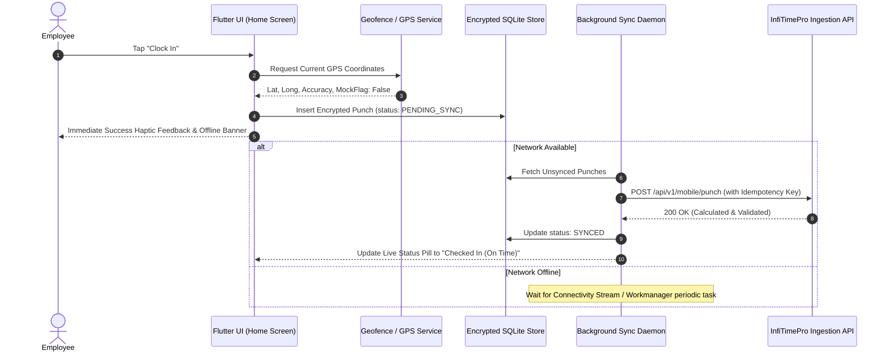

# InfiTimePro – Enterprise Time & Attendance SaaS Platform
## 13. Mobile Architecture (Flutter Cross-Platform)

This document details the client-side architecture for the InfiTimePro Flutter mobile application (supporting iOS and Android), covering offline persistence, biometric enrollment, geofencing, and background synchronization.

---

### 1. Flutter Architectural Overview

The InfiTimePro mobile client is engineered using a feature-first Clean Architecture pattern combined with BLoC (Business Logic Component) / Riverpod state management.

```
mobile/
├── lib/
│   ├── app/                     # App router, theme, localization setup
│   ├── core/                    # HTTP client, SQLite database, secure storage, sensors
│   │   ├── database/            # Local SQLite schema for offline buffering
│   │   ├── location/            # GPS geofencing & mock-detection services
│   │   ├── biometric/           # Local device biometric auth (FaceID / Fingerprint)
│   │   └── sync/                # Background punch synchronization daemon
│   ├── features/
│   │   ├── auth/                # Mobile login, SSO, organization selection
│   │   ├── home/                # Clock In/Out hero, quick metrics, pending alerts
│   │   ├── attendance/          # My Attendance, Day Detail, Calendar, Punch Timeline
│   │   ├── team/                # Live Attendance, Team List, Exceptions Hub
│   │   ├── regularisation/      # Raise Regularisation form, Request Details, History
│   │   ├── approvals/           # Manager Approvals Inbox, Regularisation/OT Approval
│   │   └── shifts/              # Team Schedule, Shift Library, Swap Requests
│   └── shared/                  # Reusable InfiTimePro UI widgets matching web tokens
```

---

### 2. Offline-First Resilience & Sync Lifecycle



---

### 3. Geofencing & Anti-Spoofing Mitigations
- **Mock Location Detection**: Inspects Android `Location.isFromMockProvider()` and iOS simulated location flags, rejecting spoofed GPS coordinates.
- **Geofence Boundary Math**: Haversine distance formula computed locally for instant client feedback before authoritative backend server verification.
- **Cellular & Wi-Fi Triangulation**: Collects connected Wi-Fi BSSID and mobile tower ID metadata for fraud prevention.
- **Facial Capture & Liveness (Optional)**: Employs on-device MLKit face mesh detection to verify natural blinking and head movement before transmitting punch selfies.
